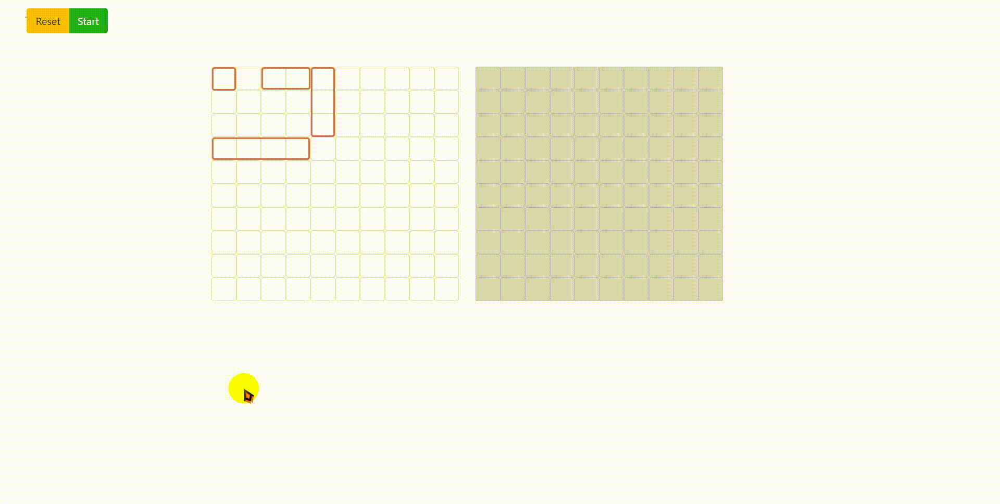

# battleship

[](https://github.com/RichardLitt/standard-readme)

> A Strategy Game built using JavaScript. [Play Game Here](https://ryto-battleship-game.netlify.com/)

TODO: Fill out this long description.

## Table of Contents

- [battleship](#battleship)
  - [Table of Contents](#table-of-contents)
  - [Background](#background)
  - [Install](#install)
  - [Usage](#usage)
  - [Screenshots](#screenshots)
  - [Maintainers](#maintainers)
  - [Contributing](#contributing)
  - [License](#license)

## Background

## Install

```
npm run prod
```

## Usage

```

```

## Screenshots



## Maintainers

[Ryan](https://github.com/rvvergara) and [Dipto](https://github.com/dipto0321)

## Contributing

By- [Ryan](https://github.com/rvvergara) and [Dipto](https://github.com/dipto0321)

## License

RYTO © 2019 Ryto Verkar
